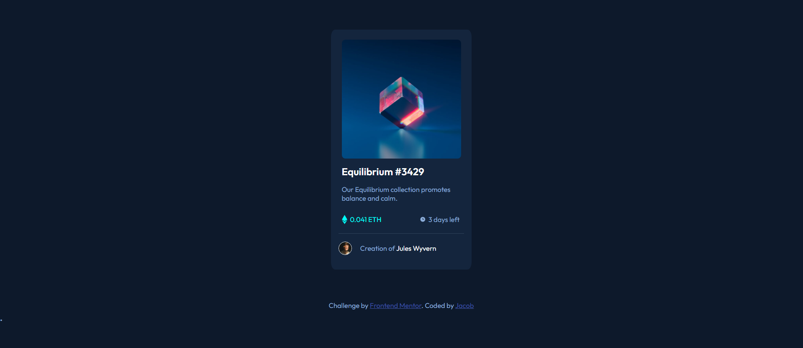

# Frontend Mentor - NFT preview card component solution

This is a solution to the [NFT preview card component challenge on Frontend Mentor](https://www.frontendmentor.io/challenges/nft-preview-card-component-SbdUL_w0U). Frontend Mentor challenges help you improve your coding skills by building realistic projects.

## Table of contents

- [Overview](#overview)
  - [The challenge](#the-challenge)
  - [Screenshot](#screenshot)
  - [Links](#links)
- [My process](#my-process)
  - [Built with](#built-with)
  - [What I learned](#what-i-learned)
- [Author](#author)
- [Acknowledgments](#acknowledgments)

**Note: Delete this note and update the table of contents based on what sections you keep.**

## Overview

### The challenge

Users should be able to:

- View the optimal layout depending on their device's screen size
- See hover states for interactive elements

### Screenshot

### Links

- [Solution URL:](https://github.com/jacobgeorge08/frontend-speedrun-week/tree/main/docs/nft-preview-card-component)
- [Live Site URL:](https://jacobgeorge08.github.io/frontend-speedrun-week/nft-preview-card-component/index.html)

## My process

### Built with

- Semantic HTML5 markup
- CSS custom properties
- Flexbox

### What I learned

- To also use the hieght property when aspect ratios of some images go out of whack
- Used :after to create a element using content:"" in CSS and finally got my hover color to work
  Not sure why it wasnt working before lol

## Author

- Website - [Jacob](https://github.com/jacobgeorge08)

## Acknowledgments

Shout out to P1xt for creating the cohort Im currently in as well as for always being in the discord to help people out.
