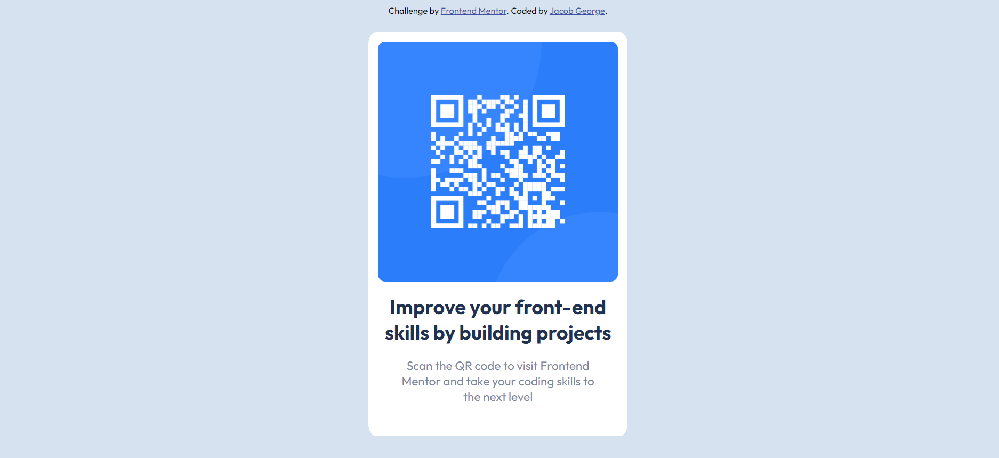

# Frontend Mentor - QR code component solution

This is a solution to the [QR code component challenge on Frontend Mentor](https://www.frontendmentor.io/challenges/qr-code-component-iux_sIO_H).

## Table of contents

- [Overview](#overview)
  - [Screenshot](#screenshot)
  - [Links](#links)
- [My process](#my-process)
  - [Built with](#built-with)
  - [What I learned](#what-i-learned)
- [Author](#author)
- [Acknowledgments](#acknowledgments)

## Overview

### Screenshot

### Links

- [Live Site URL](https://jacobgeorge08.github.io/frontend-speedrun-week/qr-code-component/index.html)

## My process

### Built with

- Semantic HTML5 markup
- CSS custom properties
- Flexbox

### What I learned

Practiced flexbox as well using responsive elements like ems and rems

## Author

- Github - [Jacob](https://github.com/jacobgeorge08)

## Acknowledgments

Shout out to P1xt for creating the cohort Im currently in as well as for always being in the discord to help people out.
